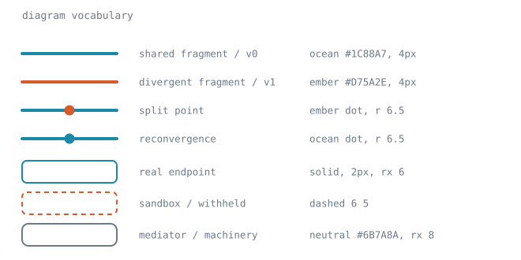

# Diagrams

How to draw a figure that will be committed to a repository and read on GitHub.
The palette lives in `src/styles/global.css`; this note is about which parts of
it survive the trip, and what the drawing vocabulary is once they have.

Two scripts, both stdlib-only like the deck's:

```sh
python3 check_contrast.py            # audit the diagram palette
python3 check_contrast.py fig.svg    # audit a figure, text and graphics apart
python3 check_tokens.py              # verify copies of the palette against global.css
```

## The constraint that shapes everything else

**A figure cannot know which theme it is being read on.** GitHub's light and
dark modes are set by an attribute on the host page, and an SVG referenced as an
image is a separate document that never sees it. It receives the reader's *OS*
`prefers-color-scheme` and nothing more — so a reader on OS-light with GitHub
set to dark gets the light rendering on a dark page.

A `@media (prefers-color-scheme: dark)` block therefore does not solve this. It
is not a matter of the block being stripped; it is answering the wrong question.
The only reliable approach is **one palette that works on both backgrounds**,
and every colour graded against `#ffffff` and `#0d1117` at once.

### The ceiling

WCAG asks 4.5:1 for normal text and 3:1 for large text and graphical objects.
Against a single background that is easy. Against both at once there is a hard
limit: the luminance that equalises the two ratios yields **≈4.35:1**, and no
colour does better. Brute-forcing all 256 greys confirms it — the best is 4.347
at `#797979`.

So **normal-size text in a dual-theme figure cannot reach AA**, whatever colour
it is. That is a property of the two backgrounds, not a failure of the palette,
and there are only three honest responses:

- accept ~4.35 and set text in the neutral below, which is at the ceiling;
- promote the label into the large-text bracket (≥24px, or ≥18.66px bold),
  where the reachable 3:1 threshold applies;
- leave colour to the strokes and set the text in the neutral.

The third is the default, and `vocabulary.svg` follows it: every label in that
figure is neutral, and colour appears only in the marks it describes.

## Palette

Measured, not asserted — `check_contrast.py` recomputes these on every run.

| role | token | hex | on light | on dark | |
| --- | --- | --- | --- | --- | --- |
| shared, baseline, v0 | `--color-ocean` | `#1C88A7` | 4.09 | 4.62 | strokes and fills |
| divergent, new, v1 | `--color-ember` | `#D75A2E` | 3.90 | 4.86 | strokes and fills |
| labels, machinery | *(derived)* | `#6B7A8A` | 4.40 | 4.30 | text; at the ceiling |

The neutral is **not a brand token**, and that is deliberate. `--color-muted`
(`#5C6B7A`) reads 5.47 on light but only 3.46 on dark, which fails the 3:1
graphics threshold outright. `#6B7A8A` is the same hue nudged to sit at the
ceiling instead of favouring one theme.

Everything else in the palette is single-theme and must not be used unmodified
in a committed figure:

| token | hex | on light | on dark | fails |
| --- | --- | --- | --- | --- |
| `--color-lagoon` | `#6CC4C8` | 2.03 | 9.34 | light |
| `--color-amber` | `#F5A337` | 2.06 | 9.17 | light |
| `--color-coral` | `#F18B40` | 2.47 | 7.67 | light |
| `--color-abyssal` | `#10253A` | 15.58 | 1.21 | dark |
| `--color-deep-sea` | `#054350` | 10.91 | 1.73 | dark |
| `--color-muted` | `#5C6B7A` | 5.47 | 3.46 | dark |

Deck slides are a different medium: they render on a background the deck itself
controls, so they use the full palette. This table governs figures committed to
a repository and read on GitHub.

## Embedding rules

- **Reference the file; do not inline it.** `` renders. An
  inline `<svg>` element in Markdown does not survive.
- **Presentation attributes, not a `<style>` block.** Inline `fill=` and
  `stroke=` on each element. This is portable across the image contexts a
  committed SVG passes through, and the theme argument above means a stylesheet
  buys nothing anyway.
- **No external fonts.** Name a stack that resolves everywhere:
  `ui-monospace, SFMono-Regular, Menlo, Consolas, monospace`. A webfont will not
  load, and the fallback silently reflows the labels.
- **No scripts, no interaction.** An SVG in an image context is inert.
- **`<title>` and `<desc>` are the alt text.** Both are read by screen readers;
  `<desc>` should say what the figure *shows*, not what it is called.
- **Estimate label widths.** At the sizes below, a monospace glyph is about
  0.6× the font size, so a 40-character label at 12.5px needs ~300 units.
  Overflow is invisible until something is cut off at a narrow viewport.

## Vocabulary



| mark | meaning |
| --- | --- |
| ocean stroke, 4px | shared, baseline, or v0 path |
| ember stroke, 4px | divergent, new, or v1 path |
| ember dot, r 6.5 | a split point |
| ocean dot, r 6.5 | a reconvergence |
| solid box, 2px, rx 6 | a real endpoint |
| dashed box, `6 5` | a sandbox, or an output that is withheld |
| neutral box, rx 8 | machinery rather than program — a mediator, a runtime component |
| neutral text, 11–13px | all labels |
| neutral bracket + caption | annotates a span of the drawing |

Rounded line caps on paths, and a `viewBox` with an explicit `width` so the
figure scales rather than pinning to a device size.

## Keeping copies honest

`src/styles/global.css` is the source of truth. Anything that cannot import it
restates the values, and a restated value rots silently — the copy keeps
rendering, just in the wrong colour. `check_tokens.py` compares each known copy
against the source and reports any token that has drifted, gone missing, or
appeared without being mapped. Add a row to its `COPIES` table when something
new restates the palette.
